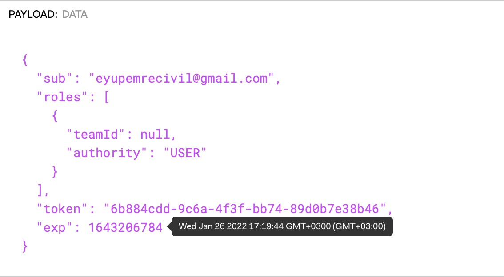

## Hazelcast Cloud - Interview Task
### Explanation
This task is about creating automated tests which will create and delete a free cluster provided by https://cloud.hazelcast.com/. I implemented this task using Spring Boot & Gradle. You can test the code yourselves by running test cases in the AutomatedTests.java class. 
### Implementation Details
#### _1. First Steps_
As instructed in the email of this task, Hazelcast Cloud does not provide an open API. Thus, the first thing I did was monitoring the network activity during each interaction I made on https://cloud.hazelcast.com/. These interactions include actions like login, list cluster plans, create/delete a cluster. By monitoring the network activity I extracted necessary URLs, HTTP actions which would help me during the process. (e.g. To list available clusters: https://coordinator.hazelcast.cloud/cluster)

At first sight, I thought I had to automate the login process as well. I signed up on Hazelcast Cloud with my GitHub account, which uses OAuth. I noticed that Hazelcast sends a request to OAuth ( https://coordinator.hazelcast.cloud/customers/oauth/github
), OAuth then talks to GitHub and finally, a code (e.g. {"code":"ff9bf02a8f641de0474c"}) is returned and it is used to authenticate the browser (me). After some research I learned that grant_type=code authentication processes only works on browser interactions, also learned that GitHub OAuth client does not support other grant types than code. 

This is exactly when I decided to decode the contents of the authorization tokens used while making requests. Using https://jwt.io/, I found out that every generated token has a 10-day expiration time. Then I figured out I did not need to automate the login process, creating and deleting a cluster would be sufficient. 

* Decoded Auth. Token Example:

i

#### _2. Coding_
First, I created an interface which has signatures of methods which makes requests to Hazelcast servers. Then, I created another class which implements methods I defined in the interface. To make requests to the servers, I used the RestTemplate class. When I completed the implementations of methods, I proceeded to code test cases. I used JUnit in this process.

I coded POJOs which are used for mapping POJOs to JSON strings for request payloads and JSON to POJOs for response bodies. There are many fields in requests/responses, I extracted only required fields by testing each request on Postman.

Creating and deleting a cluster is an async process. When a request to create a cluster is sent to a server, it immediately returns Http status code of 200. However, this does not mean the cluster is up and ready. I also figured out you cannot send a request to delete a cluster if its state is <b>not</b> "RUNNING". Hence, the test which would send a delete request to server should wait until the cluster is in appropriate state. To handle this async problem, I found out that there are libraries for async system testing, such as Awaitility. But for simplicity's sake, I implemented waiting process on my own by checking cluster's state until it is in desired state. 

Also, JUnit does not guarantee execution order of tests in a test class. This could cause a problem for this task because if the test case which sends a delete request to the server was executed before creating it, the test case would immediately fail. To force the execution order, I used @Order annotation of JUnit.

